# AI-Pass — AI Task Workspace

A full-stack web application for submitting text-based tasks, running AI-powered analysis, and viewing structured results.

---

## Arcitecture


## Stack

**Frontend**
- React 19 + TypeScript
- React Router DOM
- Plain CSS (no framework)
- Vite

**Backend**
- Node.js + Express + TypeScript
- Prisma ORM (v6.19.2)
- PostgreSQL (Neon — serverless)
- JWT authentication
- bcryptjs for password hashing

---

## Database Design

### users
| Field | Type | Notes |
|---|---|---|
| id | UUID | Primary key |
| email | String | Unique |
| password | String | bcrypt hashed |
| createdAt | DateTime | Auto |

### tasks
| Field | Type | Notes |
|---|---|---|
| id | UUID | Primary key |
| title | String | |
| taskType | String | summarize / classify_risk / extract_info |
| inputText | String | |
| status | String | pending / running / completed |
| createdAt | DateTime | Auto |
| userId | UUID | Foreign key → users |

### task_results
| Field | Type | Notes |
|---|---|---|
| id | UUID | Primary key |
| resultText | String | Human-readable summary |
| resultJson | JSON | Structured output |
| createdAt | DateTime | Auto |
| taskId | UUID | Foreign key → tasks (unique) |

---

## API Endpoints

| Method | Endpoint | Auth | Description |
|---|---|---|---|
| POST | /auth/register | No | Register new user |
| POST | /auth/login | No | Login, returns JWT |
| GET | /tasks | Yes | List all tasks for user |
| POST | /tasks | Yes | Create a new task |
| GET | /tasks/stats | Yes | Usage summary |
| GET | /tasks/:id | Yes | Task detail with result |
| POST | /tasks/:id/run | Yes | Execute AI analysis |

---

## AI Engine

The AI processing layer is implemented as a **context-aware rule-based mock engine** located in `src/services/ai.ts`.

It is intentionally architected as a drop-in replacement for any LLM API. Swapping to a real provider requires only replacing the contents of `src/services/ai.ts` — no changes to routes or database.

### How it works

**Summarize** — splits input into sentences, extracts key points from actual content, returns word count and sentence count.

**Classify risk** — scans for a tiered keyword dictionary (critical / high / medium terms), returns `PASS / FAIL / NEEDS_INFO` decision with `LOW / MEDIUM / HIGH / CRITICAL` risk level and specific risk factors found in the text.

**Extract info** — uses regex to extract emails, URLs, phone numbers, dates, names, and reference numbers from raw text.

All responses include `decision`, `confidence`, and `reasons` fields matching the assignment's required structured output shape.

A simulated network delay of 800–1400ms is applied to mimic real API latency.

### To plug in a real API
Replace `src/services/ai.ts` with any of the following — the function signature stays identical:
- OpenAI (`gpt-4o-mini`) — requires billing
- Anthropic Claude (`claude-haiku-4-5-20251001`) — requires credits
- Google Gemini (`gemini-1.5-flash`) — free tier, may have regional restrictions

---

## Running Locally

### Prerequisites
- Node.js v18+
- PostgreSQL database (or Neon free tier)

### Backend
```bash
cd backend
npm install
```

Create `.env` from `.env.example`:
```
DATABASE_URL="your-postgres-connection-string"
JWT_SECRET="your-secret-key"
```
```bash
npx prisma@6 migrate dev
npm run dev
```

Server runs at `http://localhost:4000`

### Frontend
```bash
cd frontend
npm install
npm run dev
```

App runs at `http://localhost:5173`

---

## Environment Variables

| Variable | Required | Description |
|---|---|---|
| DATABASE_URL | Yes | PostgreSQL connection string |
| JWT_SECRET | Yes | Secret for signing JWTs |
| PORT | No | Server port (default 4000) |

---

## What I Would Improve Next

- Plug in a real LLM API once network/billing constraints are resolved
- Add pagination to task history
- WebSocket support for real-time task status updates
- Rate limiting on auth endpoints
- Refresh token mechanism
- Export task results as PDF or CSV
- Role-based access for team workspaces
- Better UI

---
## Live URLs
- Frontend: https://ai-pass-frontend-8s3x.onrender.com
- Backend: https://ai-pass-backend.onrender.com
